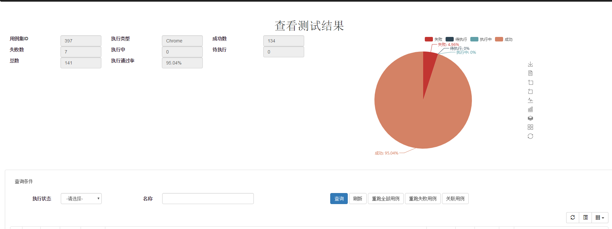
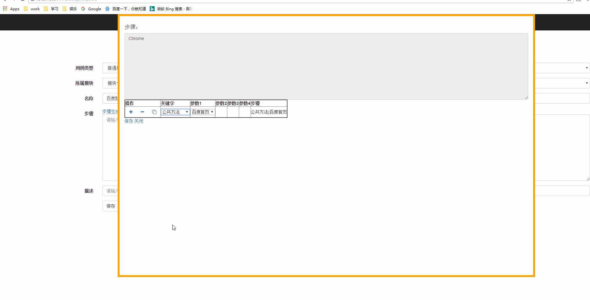
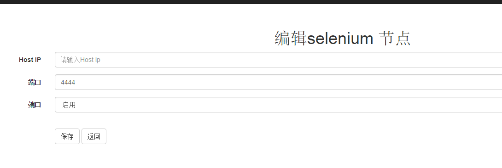
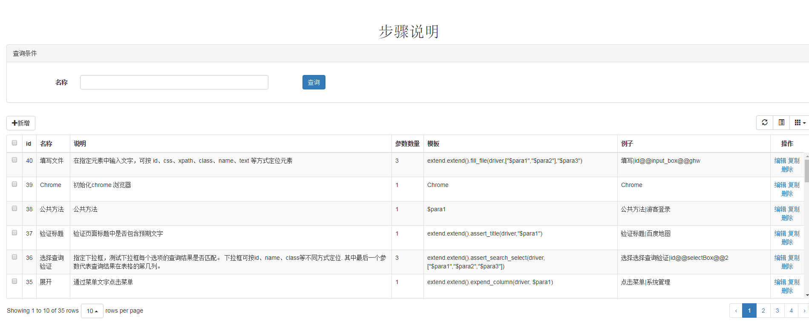
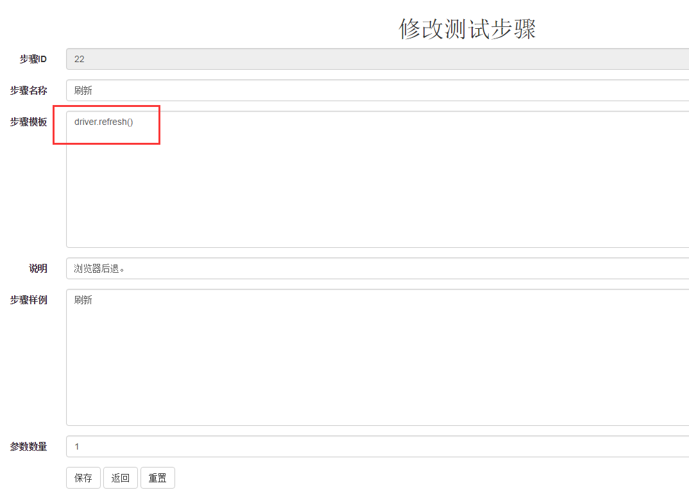
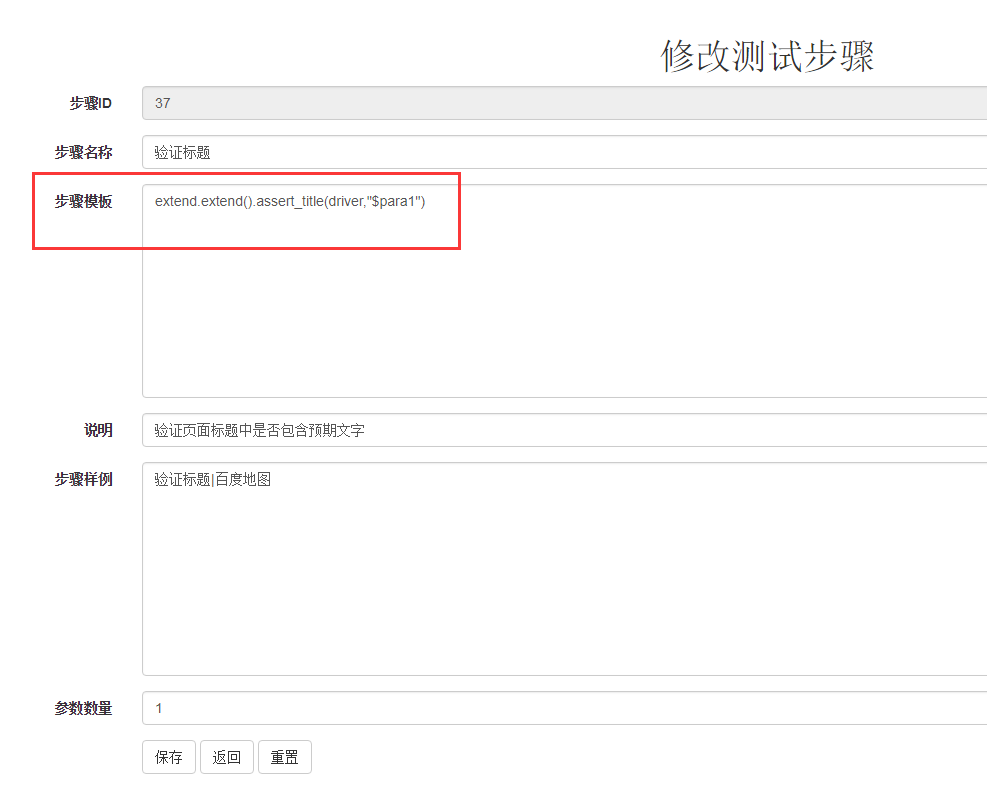

参考链接：

https://testerhome.com/topics/15534 ： Python + flask+ selenium 自动化测试用例管理、执行平台

https://testerhome.com/topics/15897 ： UI 自动化测试用例整理举例-百度首页

https://testerhome.com/topics/16106 ： 使用 python 多进程模块 multiprocessing 并发执行测试用例


# autotest_platform
基于python+selenium的自动化测试管理、执行平台。
执行效果：


用例集执行统计：


## 版本要求：
- python 3.4 以上
- selenium ： 建议使用 3.0 以上版本
- mysql : 建议 5.5 以上

## 使用说明：

### 用例编辑：
可以使用页面的编辑器编写用例步骤：




### 1. 新建用例：

用例步骤说明：
- 每个用例步骤中通过逗号进行分隔。
- 单个步骤的格式： 步骤名称+分隔符（|）+参数列表（参数间按@@进行分隔）。如：填写|id@@kw@@selenium， 表示步骤为“填写”，参数列表为“id、kw、selenium”。
- 默认的参数含义：1：通过什么属性定位目标元素（可使用id、name、class、text、xpath、css等多种定位方式进行定位） 2：目标元素对应的属性值（如id = kw） 3：其他。
- 例如：填写|id@@kw@@selenium： 代表通过 id = kw 查找到输入框，并输入  selenium 。

#### 1.1 用例初始化：
初始化可以有以下方式：

- 指定浏览器类型，如 Chrome、 Firefox。 需要对应的selenium server支持。
- 指定模拟手机型号， 如 Chrome|iPhone 6。目前只有 chrome 浏览器支持模拟手机。
- 调用其他已封装的公共方法，如 公共方法|登录。 具体的公共方法格式与正常用例一致，但需要指定用例类型为 公共用例。
- 公共方法支持嵌套，即一个公共方法里调用另一个公共方法。

#### 用例说明：

#### 一. 使用chrome 浏览器进行测试：
例子：在百度中输入selenium，并验证查询结果是否正确。
```
Chrome,前往|http://www.baidu.com,填写|id@@kw@@selenium,点击|id@@su,验证|Web Browser Automation,截图
```
步骤解析：
```
- Chrome： 调用 Chrome driver 进行测试。
- 前往|http://www.baidu.com ：  前往目标页。
- 填写|id@@kw@@selenium ：  在 id 为 kw 的元素中输入 selenium。
- 点击|id@@su ： 点击 id 为 su 的元素。
- 验证|Web Browser Automation ：  验证页面中是否出现 ‘Web Browser Automation’ 的文字。
- 截图： 对当前页面进行截图并保存。
```


#### 二. 使用chrome 浏览器模拟移动设备进行测试：
例子：模拟iPhone 6 打开网页，在百度中输入selenium，并验证查询结果是否正确。
```
Chrome|iPhone 6,前往|http://www.baidu.com,填写|id@@kw@@selenium,点击|id@@su,验证|Web Browser Automation,截图
```
步骤解析：
```
- Chrome|iPhone 6： 调用 Chrome driver 进行测试，并设置页面大小为模拟  iPhone 6。
```


### 2.公共用例

某些公共的步骤，可以封装为公共方法进行调用：
- 公共方法添加：新建用例，选择用例类型为 公共用例， 所属模块为public。
- 公共方法调用：步骤： 公共方法|公共方法名， 如  公共方法|登录；公共方法|查询订单。


#### 三. 使用公共方法进行测试：
例子：
1. 添加公共方法： 打开 chrome 浏览器，并打开百度首页
```
// 添加公共方法： 注意需将用例类型设置为 ： 公共用例， 所属模块设置为： public， 用例名称： 打开百度首页
Chrome,前往|http://www.baidu.com
```
2. 分别添加测试用例：在百度首页分别点击新闻、地图、视频，并验证跳转页面是否正确。

```
公共方法|打开百度首页,点击|name@@tj_trnews,验证标题|百度新闻
公共方法|打开百度首页,点击|name@@tj_trmap,验证标题|百度地图
公共方法|打开百度首页,点击|name@@tj_trtieba,验证标题|百度贴吧
```

步骤解析：
```
- 公共方法|打开百度首页： 根据所指定的用例名称，将公共用例的步骤拼接在当前用例之前执行。

```

效果等同于：

```
Chrome,前往|http://www.baidu.com,点击|name@@tj_trnews,验证标题|百度新闻
```


3. 公共方法支持嵌套，如：

```
// 公共方法1： 打开百度首页
Chrome,前往|http://www.baidu.com

//公共方法2： 进入百度新闻
公共方法|打开百度首页,点击|name@@tj_trnews,验证标题|百度新闻

// 用例： 进入百度新闻页后，点击贴吧
公共方法|进入百度新闻,点击|name@@tj_trtieba,验证标题|百度贴吧
```

效果等同于：

```
Chrome,前往|http://www.baidu.com,点击|name@@tj_trnews,验证标题|百度新闻,点击|name@@tj_trtieba,验证标题|百度贴吧
```


### 3.用例管理：

还可对用例进行如下管理：
- 用例查询
- 用例复制：新建用例时可考虑复制一条步骤类似的用例，再修改对应步骤。
- 用例删除：逻辑删除，可在数据库对应表中恢复。
- 用例执行：执行单条用例。可查看对应执行记录、截图、或重跑用例。


### 4.用例集管理：

- 用例集（test suite）对应一个测试范围，可关联多个不同的用例。
- 执行用例集时会根据设置的并发数进行并发执行，提高测试效率。
- 用例集中的用例是从测试用例中复制而来，因此每个用例可以在多个不同的测试用例集中关联。
- 用例集可重跑全部用例、重跑失败用例、重跑单条用例。 注意：重跑用例时，会自动从对应测试用例中加载最新的步骤。


### 5.节点管理：
- 节点：可加载多个selenium grid节点，系统根据当前可用节点的数量，分配用例进行执行。

### 6.步骤管理：
- 步骤：现已对大部分常见步骤进行了封装。
- 扩展封装：可根据需要进行扩展封装。
- 可直接封装selenium的方法，请参考 刷新、前往、悬浮点击 等方法。
- 可对selenium提供的方法进行二次封装，请参考 点击、填写、选择等方法。对应扩展代码可在  app/core/extend.py 文件中进行管理。

### 7.atx

- 基于atx 进行封装，从数据库中读取需要执行的测试用例，并转化、执行、记录测试结果及截图。
- 需安装atxserver（https://github.com/openatx/atx-server ）

### 7.1. android 用例组织：
样例：
Android|com.your.packagename,点击|id@@com.your.packagename:id/btn_login,等待|2,点击|name@@GuestLogin,等待|5,截图,

### 7.2 已封装步骤：
相关的步骤已封装在  app/core/atx_step.py 中，具体包括：

Android ： 打开指定已安装的app （通过包名）
填写： type_text
点击： click （by id/name/description/class）
截图： take_screenshot

由于我测试的 app 功能较为简单，目前只封装了这几个方法，如果需要可增加封装对应的方法。


<!--## 1. 管理平台：-->
<!--基于flask进行开发，进行用例、用例集、步骤等的增删改查等功能。-->

<!--启动 flask：-->
<!--```-->
<!--python run.py-->
<!--```-->


<!--## 2. 启动core服务：-->
<!--```-->
<!--python core.py-->
<!--```-->


<!--- 基于selenium进行封装，从数据库中读取需要执行的测试用例，并转化、执行、记录测试结果及截图。-->
<!--- 需结合selenium grid 或 selenium docker 作为节点进行具体执行载体。-->


<!--## 3. 启动atx core服务（需要安装对应的 atxserver ；  如不需使用该部分请跳过）：-->
<!--```-->
<!--python atx_core.py-->
<!--```-->


<!--- 基于atx 进行封装，从数据库中读取需要执行的测试用例，并转化、执行、记录测试结果及截图。-->
<!--- 需安装atxserver（https://github.com/openatx/atx-server ），并修改 app/config.py 文件的以下内容：-->

<!--```-->
<!--# atx 配置-->
<!--isUseATX=True   # True 代表使用 atx-->
<!--ATXHost = 'http://172.16.100.168:8002'       # 对应的 atxserver 地址-->
<!--```-->


——————————————————————————————————————————————————————————————————————————————————————


# GET START:
## 安装步骤：
### 1. clone 或下载代码包到本地解压:
```
git clone https://github.com/jerrylizilong/autotest_platform.git
```


### 2. 按requirements.txt 安装依赖:
```
cd autotest_platform
pip3 install -r requirements.txt
```
###  3. 数据库配置：
#### 3.1 在mysql中创建数据库，并执行 init.sql 建表并初始化配置数据。
#### 3.2修改 app/config.py 中关于数据库部分的配置： host、port、database、user、password。
```
 db_host='localhost'
 db_port='3306'
 db_user='root'
 db_password='yourpassword'
 database='test_auto_new'
```
###  4. 邮件配置：修改 app/config.py 中关于邮件部分的配置（如不需要发送邮件，请忽略）。

```
# smtp 发送邮件相关配置：
is_email_enable = False   #发送邮件开关
flask_host = 'http://localhost:5000'  # 邮件中的报告链接会使用
smtp_server_host = 'smtp.163.com'  # 如使用其他的smtp 服务，请修改对应host 和端口
smtp_server_port = '25'
smtp_from_email = 'youraccount@163.com'   # 发送邮件的邮箱账号
smtp_default_to_email = 'youraccount@163.com'   # 默认接收邮件的邮箱账号
smtp_server_user = smtp_from_email
smtp_server_password = 'yourpassword'     # 发送邮件的邮箱密码
```

### 5 修改 app/config.py 中关于 atx server 配置（如不需要使用 atx 测试android 设备 ，请忽略）：
```
# atx 配置
isUseATX=True
ATXHost = 'http://localhost:8000'
```

## 启动：
### 1.启动 flask：
```
python run.py 
```
       
此时可通过访问  localhost:5000  访问登录界面。
初始用户及密码：  admin/0
### 2.1 启动 core service（selenium 的执行服务）：
```python
python core.py
```

## 2.2. 启动atx core服务：
```
python atx_core.py
```


### 3. selenium 接入

selenium 最终接入的效果是提供可执行的selenium 环境供系统执行用例。节点管理页面必须有可以使用、并状态为开启的节点才能执行用例。


可以按以下两种方式进行接入：
#### 3.1 selenium server接入：
- 服务端启动：
 ```
 python run_service.py
 ```
 将通过9998 端口监听节点启动、关闭状态

- selenium grid 节点启动： 将app/client 目录复制到已安装selenium driver 的服务器/PC 中，修改client.py文件中host 为服务端对应地址，并启动： 
```python
python client.py
```

服务启动后，会启动 selenium server，并注册到服务器中。

#### 3.2 其他方式（原有selenium server、selenium docker等）
- 将已启动的selenium服务地址手动添加到自动化测试-节点管理中。


#### 附： docker 搭建selenium 镜像命令：
拉取相关镜像：
```
docker pull selenium/hub
docker pull selenium/node-chrome
docker pull selenium/node-firefox
```
启动 hub :
```
docker network create grid
docker run -d -p 4444:4444 --net grid --name selenium-hub selenium/hu
```
启动节点：
```
# 建议 NODE_MAX_INSTANCES、NODE_MAX_SESSION 两个参数都设置为 10，便于并发执行
docker run -e NODE_MAX_INSTANCES=10 -e NODE_MAX_SESSION=10 -d --net grid -e HUB_HOST=selenium-hub selenium/node-firefox
docker run -e NODE_MAX_INSTANCES=10 -e NODE_MAX_SESSION=10 -d --net grid -e HUB_HOST=selenium-hub selenium/node-chrome
```


### 4.自定义关键字：
可以在 步骤管理  页面对已封装的关键字进行管理，或添加新的关键字：


#### 4.1 封装selenium 命令
可以直接将 python selenium 的执行语句直接封装成新的关键字方法：



#### 4.2 封装自定义方法为关键字
1. 在 app/core/extend.py 文件中新增新的自定义方法, 如：
```
    def assert_title(self,driver,text):
        log.log().logger.info('目标文本：%s， 期待包含文本：%s' % (driver.title, text))
        assert text in driver.title
```

2. 将封装的方法添加到步骤管理中：


# 常见问题：
### 1：没有可用的节点
- Q： 运行用例之后会提示这个-ERROR: no hubs is availabe!
- A： 说明没有可以使用的selenium节点执行测试。请检查是否已启动对应的 selenium server，并已配置到节点管理中，而且服务器可以正常访问该节点。

### 2：selenium 的浏览器被占用
- Q：使用docker启动的selenium 镜像服务，如果用例执行报错， selenium grid console中的Chrome浏览器好像被置灰不可用了
- A：这是因为如果执行报错时，没有正常退出 driver，导致对应的selenium线程持续被占用，需要等待一段时间才能释放。建议启动docker 的时候把最大进程设置为10， 这样可以并发执行，提高使用率：
```
sudo docker run -e NODE_MAX_INSTANCES=10 -e NODE_MAX_SESSION=10 -d --net grid -e HUB_HOST=selenium-hub -v /dev/shm:/dev/shm selenium/node-firefox-debug
```
### 3：selenium 相关报错
- Q：selenium相关报错
- A：可能对应的 selenium server版本不支持目前使用的一些功能，建议更新到较新版本的 selenium server

